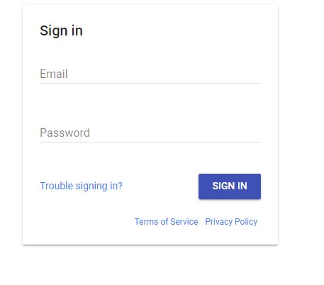
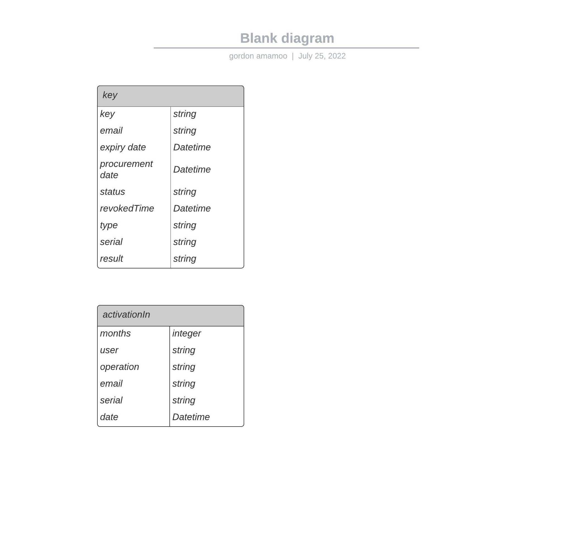

##  Title: Access Key Manager
### Project Objective
Micro-Focus Inc., a software company has built a school management platform that is multitenant i.e., various schools can set up on the platform as though the platform was built specifically for them. They have agreed to use an access key-based approach to monetize it rather than building payment features into the school software. They have decided to outsource the project to you, to build a key manager, a web application that schools can use to purchase access keys to activate their school account.

### Architecture
    + Frontend : `react` and 'react-router-dom'
    + Backend : Node.js and Google Cloud Functions(Node.js)
    + Database : Google Cloud Firestore

### [live webapp here- Deployed link](https://amalitech-node-project.el.r.appspot.com/static/amalitech/projects/keyManager/user/index.html)

### Customer Requirements
School IT Personnel
1. Should be able to signup & log in with an email and password 
    + click profile photo icon and then `verify email` on side menu for email account verification. 
    + click `Trouble sigining in` to  reset password and to recover lost passwords.


2. Should be able to see a list of all access keys granted: active, expired or revoked.
    + click on `Access keys` on the menu bar
3. For each access key, the personnel should be able to see the status, date of procurement and expiry date.
    + double click on any row on the access keys table to view details
4. A user should not be able to get a new key if there is an active key already assigned to him/her. Only one key can be active at a time.
    + click on `purchase key` on the menu bar  to get a new key

### Focus Admin
1. Should be able to log in with an email and password.
    + click on the `log in` button on the menu bar 
2. Should be able to manually revoke a key
    + double click on any row in the keys table to revoke a key
3. Should be able to see all keys generated on the platform and see the status, date of procurement and expiry date.
    + double click on any row in the keys table to
4. Should be able to access an endpoint, such that if the school email is provided, the endpoint should return status code 200 and details of the active key if any is found, else it should return 404. This is to enable them to integrate their school software with your key manager
    + send a post request with body json body - `{"email":"some email adress"}`  
    + send a post resquest with body `email=YourEmailAddress` (application/x-www-form-urlencoded)

#### Endpoint
```
https://amalitech-node-project.el.r.appspot.com/amalitech/keyManager/CheckKeyStatus

```
    + 200 response
```json
{
    "key": "123NsmkhdskgfudibdHmfs",
    "status": "active",
    "email":"activeaccess@gmail.com",
    "Procurement date": "2022-07-20T17:53:09.230Z",
    "Expiry date": "2022-08-20T17:53:09.230Z"
}
```
    + 404 response
```json
{
    "status": "No Active Key Found",
    "email": "noactivekey@gmail.com"
}
```


### ER diagram of database design


